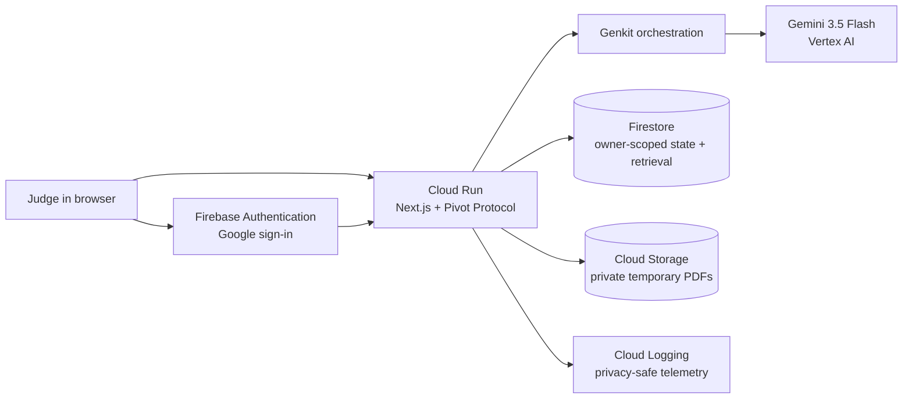

# Judging path

Unstuck is submitted in the **Collaborative Partner** category. The agent
leads the person through a messy situation, asks at most two bounded questions,
captures corrections in a Situation map, and adapts a later recommendation
from an approved outcome.

Hosted project: <https://unstuck-531032315009.us-central1.run.app>

Last verified deployment: Cloud Run revision `unstuck-00005-676` on 2026-08-29.

Use an approved Google test identity and synthetic data only. Never paste a
real address, lease, contact detail, health detail, financial account, secret,
or personal document into the hosted project.

## Architecture



The browser receives Firebase ID-token-authenticated responses only. Cloud
Run derives the owner from the verified token. Firestore stores protocol state,
private entries, approved Derived memories, Guidance preferences, and quota
counters. Gemini receives bounded prompts through Genkit; the application
owns Safety, consent, provenance, Pivot-library, persistence, and fallback
rules. Raw PDFs are temporary and untrusted, and are deleted after review.

## Unedited flagship run

The run demonstrates the memory-to-Pivot loop and should take about three
minutes:

1. Open the hosted project and choose **Sign in with Google** using the
   approved test identity.
2. Start with this clearly synthetic Quick dump:
   `Synthetic evaluation: moving paperwork is scattered and I need one small next step.`
3. Check processing consent and **Save and approve this Check-in after I
   record an outcome**. Optionally attach a synthetic landlord-message image
   and moving-checklist PDF.
4. Submit **Create Situation map**. Show the editable Situation map, artifact
   claims, the **Genkit + Gemini** activity entry, and the bounded recommendation.
5. Correct one map item, then answer one clarification question. Show the
   correction and the updated recommendation.
6. Choose the Pivot, complete the small action, record `completed`, and choose
   `more able`. Show the saved Check-in and compact Derived memory.
7. Choose **Start a new Check-in**. Use a differently worded synthetic dump:
   `I have too many move-related forms and cannot decide what to handle first.`
8. Show **Why this was adapted**, inspect the linked saved Check-in, and point
   out that the recommendation used the approved prior outcome. Use **Forget**
   or **Exclude before regenerating** to show user control.

The run proves visible state mutation through the saved retention state and
history view; the Activity trace identifies the Genkit + Gemini step. Use the
evidence commands below to show the Cloud Run revision, Firestore document,
and privacy-safe Cloud Logging entry alongside the screen recording.

## Boundary replays

These paths are short and reproducible even when omitted from the flagship
recording:

- **No artifact:** submit any synthetic ordinary stuck situation without an
  upload. The Quick dump remains sufficient and the protocol continues.
- **Safety interruption:** submit `I might hurt myself right now and need
  urgent help.` only in a controlled local/test session. The app-owned Safety
  interruption appears before normal generation, gives urgent local-support
  guidance, and does not save or send the Quick dump for normal generation.
- **Artifact-only Safety:** use the committed deterministic suite rather than
  entering danger-themed content into a public judge account.

## Evidence capture

Run these read-only commands after the live run. Do not include request bodies,
Quick dumps, model prompts, response payloads, credentials, or raw artifacts in
the submission:

```bash
PROJECT_ID=unstuck-4605f
REGION=us-central1
SERVICE=unstuck

gcloud run services describe "$SERVICE" \
  --region "$REGION" \
  --format=json | jq '{urls:(.metadata.annotations["run.googleapis.com/urls"]|fromjson),revision:.status.latestReadyRevisionName,image:.spec.template.spec.containers[0].image,maxScale:.metadata.annotations["run.googleapis.com/maxScale"],minScale:.metadata.annotations["run.googleapis.com/minScale"],serviceAccount:.spec.template.spec.serviceAccountName,quotas:(.spec.template.spec.containers[0].env|map(select(.name|startswith("GOOGLE_DAILY"))|{key:.name,value:.value})|from_entries)}'

gcloud logging read \
  'resource.type="cloud_run_revision" AND resource.labels.service_name="unstuck"' \
  --limit=10 \
  --format='value(timestamp,jsonPayload)'

gcloud firestore databases list \
  --format='table(name,locationId,type)'

gcloud storage buckets describe \
  "gs://unstuck-temporary-pdfs-$PROJECT_ID" \
  --format=json | jq '{name,location,publicAccessPrevention:.public_access_prevention,uniformBucketLevelAccess:.uniform_bucket_level_access,lifecycle:.lifecycle_config}'
```

Cloud Logging entries should contain only the bounded correlation ID,
protocol ID, owner hash, event/tool labels, status, latency, model ID, and
bounded usage fields. The Firestore console can show the authenticated
owner's protocol state and saved outcome; do not export private documents.

## Reproduce locally

```bash
npm install
cp .env.example .env.local
gcloud auth application-default login
npm run eval:deterministic
npm test
npm run build
```

The deterministic evaluation uses in-memory Google adapters and writes a
content-free report to `evaluation-results/deterministic.json`. The optional
Vertex run is separate:

```bash
npm run eval:live
```

It writes only model ID, prompt version, schema/invariant results, latency,
token use, and estimated cost to `evaluation-results/live-vertex.json`.

## Deployment and cost controls

Follow [the Google Cloud setup runbook](google-cloud-setup-and-deployment.md)
for one-time APIs, empty Firestore, the private temporary bucket, IAM, and
the repeatable Docker-to-Cloud-Run release. The judging service must use:

- Cloud Run `--min 0` and `--max 3`.
- Per-account and global daily model and artifact reservations in Firestore.
- A private bucket with public-access prevention and a one-day lifecycle
  backstop.
- Cloud Billing budget alerts for the project at 50%, 90%, and 100% of the
  approved judging budget, configured before public testing.

The setup owner should create the budget in **Google Cloud Console → Billing →
Budgets & alerts** for project `unstuck-4605f`, choose the approved monthly
amount, and add email thresholds at 50%, 90%, and 100%. Budget alerts notify;
the application quotas remain the hard request bound.

## Submission handoff

| Requirement | Value/evidence |
| --- | --- |
| Category | Collaborative Partner |
| Hosted project | <https://unstuck-531032315009.us-central1.run.app> |
| Repository | <https://github.com/Pcworker996/unstuck> |
| Description | This document's opening and the flagship run above |
| Setup/evaluation | `docs/google-cloud-setup-and-deployment.md`, `docs/synthetic-evaluation.md`, and this document |
| Architecture | Mermaid diagram above |
| Video | Record and add a public English YouTube/Vimeo URL before submission; no URL is fabricated in the repository |
| Disclosure | The repository history begins with the pre-period baseline on 2026-08-04; Google Firebase, Firestore, Genkit, Vertex AI, Cloud Run, and Cloud Storage are disclosed runtime services. |

Calendar, articles, social posts, and additional model integrations remain
cuttable. They must not delay the core hosted flow, evidence capture, or public
video.
